<h1>Tutorial OAuth Microsoft App Flask</h1>

    Steps to create the app in Microsoft Azure

<a href="https://entra.microsoft.com/#view/Microsoft_AAD_RegisteredApps/CreateApplicationBlade/quickStartType~/null/isMSAApp~/false?Microsoft_AAD_IAM_legacyAADRedirect=true">Link Microsoft Register App</a>

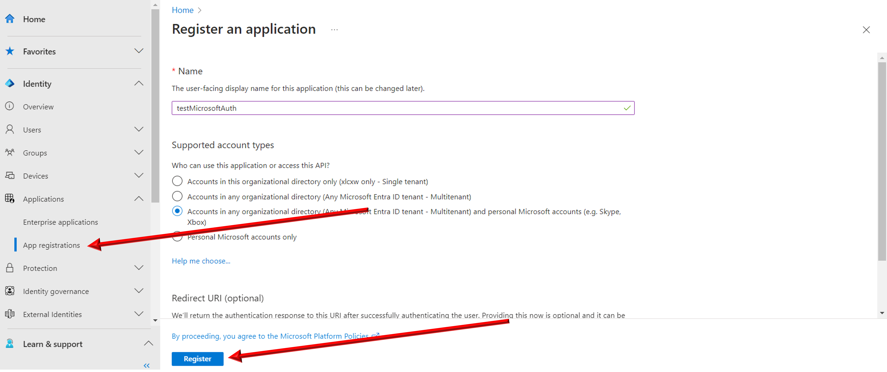

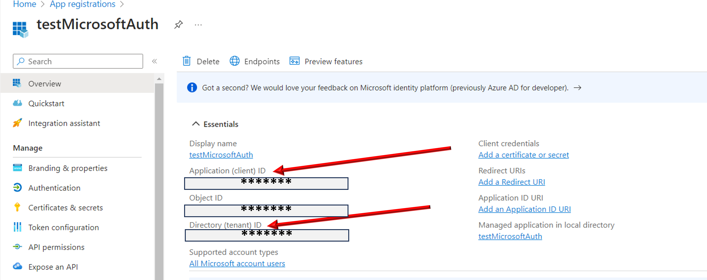

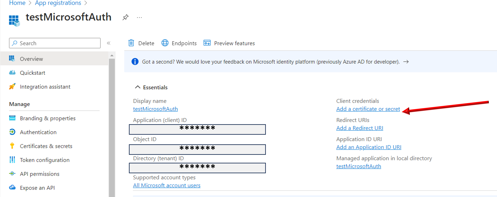

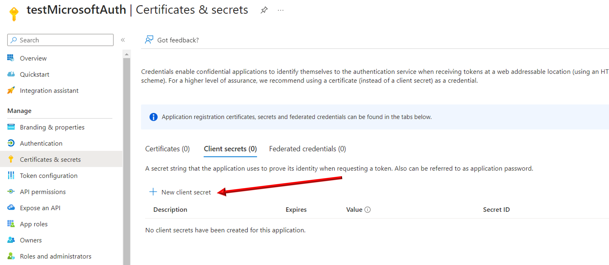

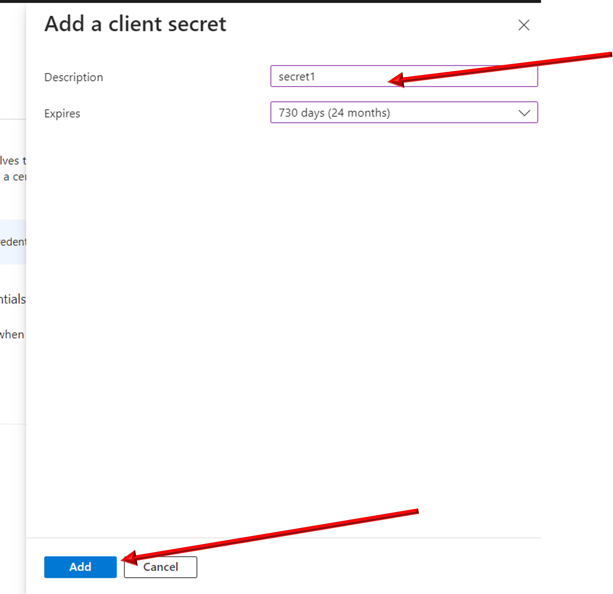

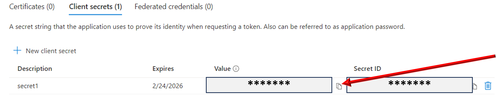

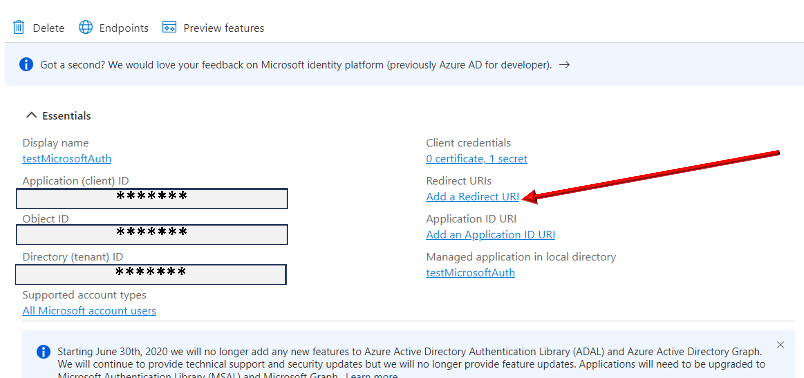

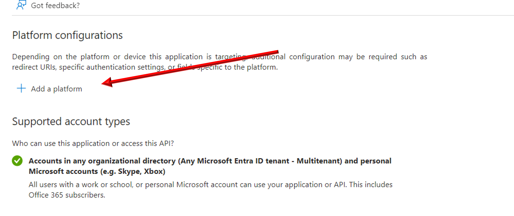

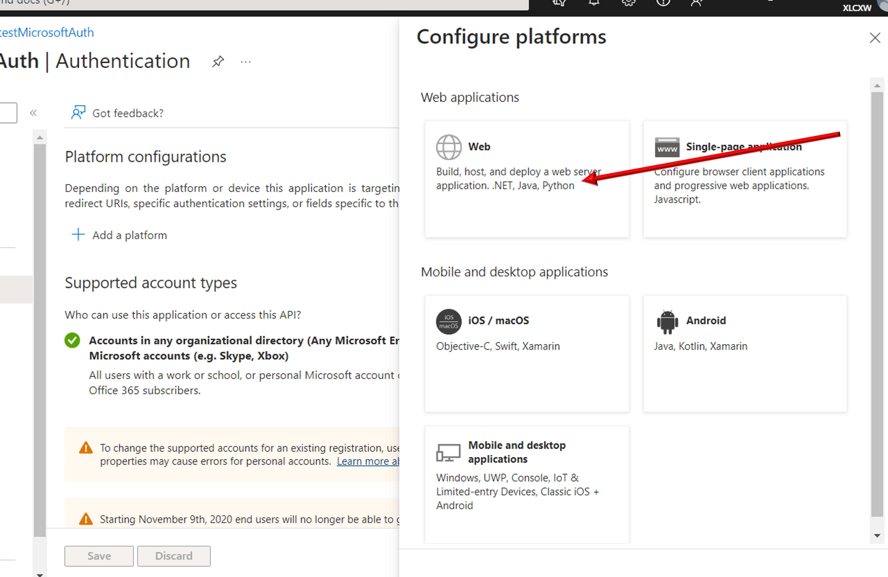

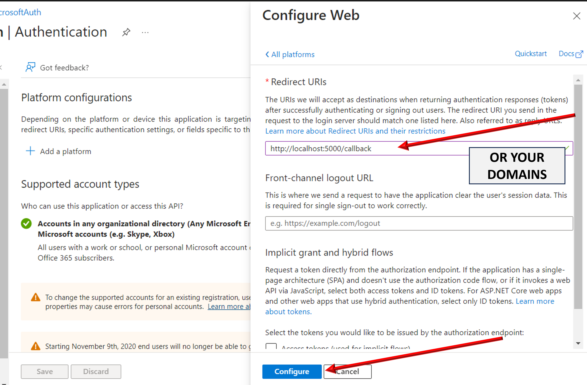

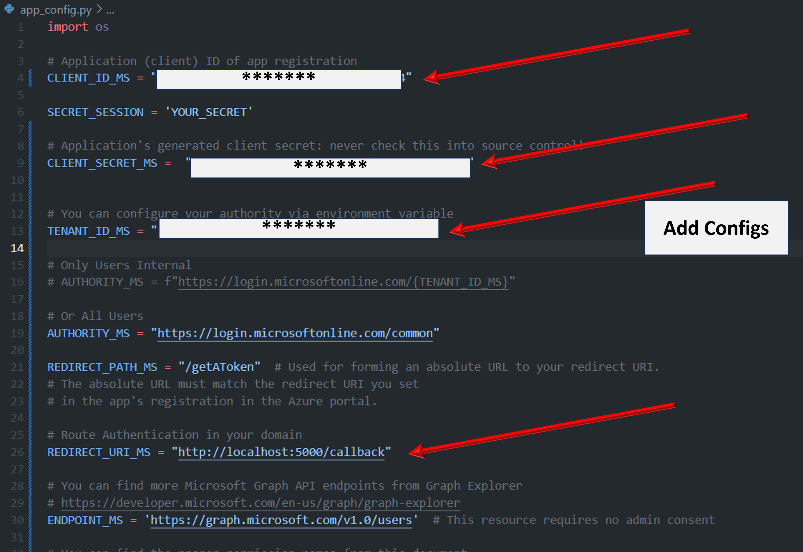

Add in file app_config!

